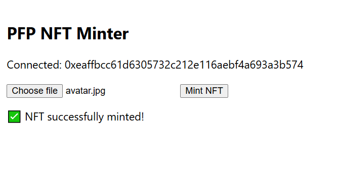

# NFT Image Minting DApp – Polygon + IPFS

A simple full-stack DApp to mint image-based NFTs on the Polygon testnet using IPFS for decentralized storage.

## 🎯 Project Objective

This project demonstrates how to mint NFTs (Non-Fungible Tokens) on the Polygon testnet using a simple React + Node.js application.

The core functionality includes:

-Uploading an image file from the frontend

-Storing the image and its metadata on IPFS via Pinata

-Minting an NFT that points to the IPFS-hosted metadata using a smart contract deployed on Polygon (Amoy testnet)

It provides a beginner-friendly example of integrating blockchain (Solidity + Polygon) with a full-stack DApp


## 🛠 Smart Contract Development using Hardhat
This project uses Hardhat to manage the smart contract lifecycle:

Compile the Solidity NFT contract to generate the ABI.

Deploy the contract to the Polygon Amoy testnet.

Export the contract address and ABI for frontend interaction.

Enables easy testing and debugging during development.

Hardhat bridges the backend (Solidity) and frontend (React + Ethers.js) by simplifying contract compilation, deployment, and integration.

## 💻 Technologies Used

- **Solidity** – Smart contract
- **Hardhat** – Development & deployment framework
- **React.js** – Frontend interface
- **Ethers.js** – Blockchain interaction from frontend
- **Node.js + Express** – Backend API for image and metadata upload
- **Pinata** – IPFS file + JSON hosting
- **Polygon Amoy Testnet** – Blockchain network for minting NFTs

## 🖼️ Screenshots



---

## Setup Instructions

1. **Clone the repository**
    ```bash
    git clone https://github.com/Rumpa-Dey/nft-dapp-polygon.git
    cd nft-dapp-polygon
2. **Install dependencies**
    ```bash
    npm install
3. **Smart Contract compilation using Hardhat**
    ```bash
    cd contract
    npm install
    npx hardhat compile
4. **Deploy the Smart contract to Polygon Amoy Testnet**
    ```bash
    npx hardhat run scripts/deploy.js --network polygon_amoy
  After deploying, copy the contract address and ABI from the output and update them in your frontend code.

5. **Start the Backend**
    ```bash
    node server.js
6. **Start the Frontend**
    ```bash
    cd nft-frontend
    npm install
    npm start
  This will start the React app on http://localhost:3000
## 🧪 Testnet Configuration

This project uses the Polygon Amoy Testnet.

You can get free test MATIC here: https://faucet.polygon.technology/

## 📃 License

This project is licensed under the MIT License.
